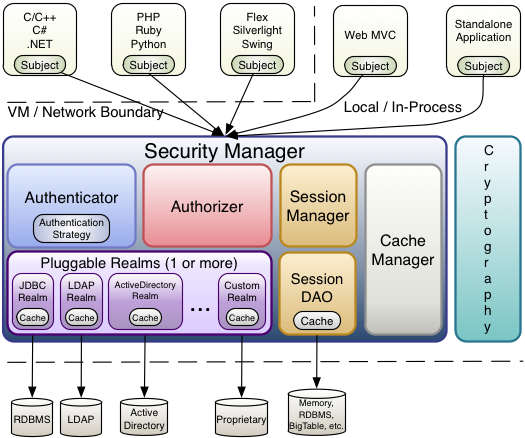

## Shiro Security Framework
### Description
Apache Shiro™ is a powerful and easy-to-use Java security framework that performs authentication, authorization, cryptography, and session management. With Shiro’s easy-to-understand API, you can quickly and easily secure any application – from the smallest mobile applications to the largest web and enterprise applications.

### Technology
* Language: Java 11
* Build Tool: Maven
* Spring Boot: 2.7.5
* Database: Mysql

| id   | email         | password |
| ---- | ------------- | -------- |
| 1    | test@test.com | 123      |
| 4    | aaa@a.com     | 789      |
| 5    | 123@123.com   | 123456   |
| 6    | 789@789.com   | 123456   |

# Shiro-SpringBoot

This demo is designed for beginners to quickly understand Shiro's authentication and authorization

# [Visit official website](https://shiro.apache.org/)

# What is Shiro?
Shiro is an open source security framework under Apache . It extracts the functions related to security authentication of the software system to realize user identity authentication, authority authorization, encryption, session management and other functions, forming a general security authentication framework.

# Features of Shiro
- Shiro is a powerful and flexible open source security framework that handles authentication, authorization, session management, and password encryption very clearly. Here are its features:
- Easy-to-understand Java Security API;
- Simple identity authentication (login), support for multiple data sources (LDAP, JDBC, etc.);
- Simple authorization (access control) for roles, also supports fine-grained authentication; supports first-level cache to improve application performance;
- Built-in POJO-based enterprise session management, suitable for Web and non-Web environments;
- Heterogeneous client session access;
- Very simple encryption API;
- It is not bundled with any framework or container and can run independently.

# Shiro Core Architecture

# Shiro Core Components 

## Subject
Subject, the external application interacts with the subject, and the subject takes the user as the subject of the current operation. This subject can be a user requesting through a browser, or a running program. Subject is an interface in shiro, which defines many methods related to authentication and authorization. External programs perform authentication and authorization through the subject, and the subject performs authentication and authorization through the SecurityManager security manager.

# SecurityManager
SecurityManager permission manager, which is the core of shiro, is responsible for security management of all subjects. The authentication and authorization of the subject can be completed through the SecurityManager. The SecurityManager is authenticated through the Authenticator, authorized through the Authorizer, and session management through the SessionManager. SecurityManager is an interface that inherits the three interfaces of Authenticator, Authorizer, and SessionManager

# Authenticator
Authenticator is the authenticator, which authenticates the identity of the user when logging in

# Authorizer
Authorizer authorizer, the user passes the authentication through the authenticator, and needs to use the authorizer to judge whether the user has the operation authority of this function when accessing the function.

# Realm (database reading + authentication function + authorization function realization)
The Realm field is equivalent to the datasource data source. SecurityManager needs to obtain user permission data through Realm for security authentication. For example:

If the user identity data is in the database, then realm needs to obtain the user identity information from the database.

Notice:

Don't understand realm as just getting data from the data source, there are related codes for authentication and authorization verification in realm .

# SessionManager
SessionManager session management, the shiro framework defines a set of session management, which does not depend on the session of the web container, so shiro can be used in non-web applications, and can also centralize the session management of distributed applications. This feature enables it to achieve sign in.

# SessionDAO
SessionDAO is a session dao, which is a set of interfaces for session operations. For example: the session can be stored in the database through jdbc, or the session can be stored in the cache server

# CacheManager
CacheManager cache management, store user permission data in the cache, which can improve performance

# Cryptography
For Cryptography password management, shiro provides a set of encryption/decryption components for easy development. For example, providing commonly used functions such as hashing and encryption/decryption

# Three cores of Shiro
1. Subject: The person who is interacting with the system, or a third-party service. All Subject instances are bound (and required) to a SecurityManager.

2. SecurityManager: The heart of the Shiro architecture, used to coordinate internal security components, manage internal component instances, and provide various services for security management through it. When Shiro interacts with a Subject, it is essentially the SecurityManager behind the scenes that handles all the heavy lifting of Subject security operations.

3. Realms: Essentially a specific security DAO. When configuring Shiro, at least one Realm must be specified for authentication and/or authorization. Shiro provides a variety of available Realms to obtain security-related data. Such as relational database (JDBC), INI and property files, etc. You can define your own Realm implementations to represent custom data sources.

# Simple understanding:

Subject is the user currently requesting login

SecurityManager is Shiro's core security manager, and it can also help us handle some businesses such as logout, jumping to 404 pages, etc.

Realm is a security screening condition. Usually, due to different businesses, most of us use custom methods to define Realm

